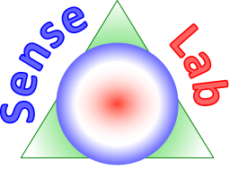

# SenseLab

**Open sensors monitoring and device control in Your lab**

Prototype of SenseLab using .NET Core and Universal Windows Platform.

You can visit project page at
  - Czech
    - http://ce-ma-s.net/projekty/software/senselab/start
  - English
    - http://ce-ma-s.net/en/projekty/software/senselab/start
    
We have limited capacity to develop this software now and devote our time to another clean technology developments.
**You are welcome to take the ideas or prototype in its current state further and create open platform useful for others.**
